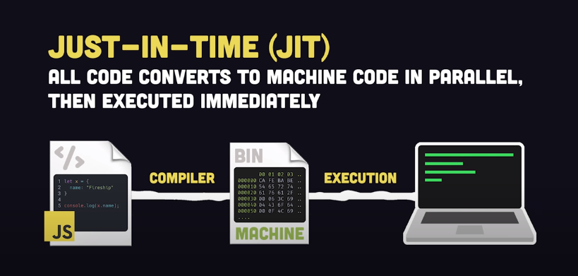
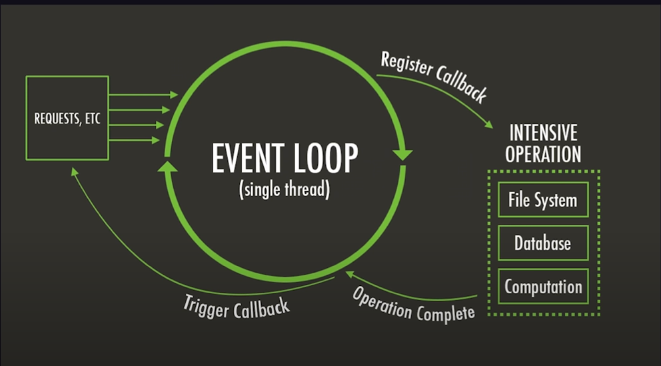
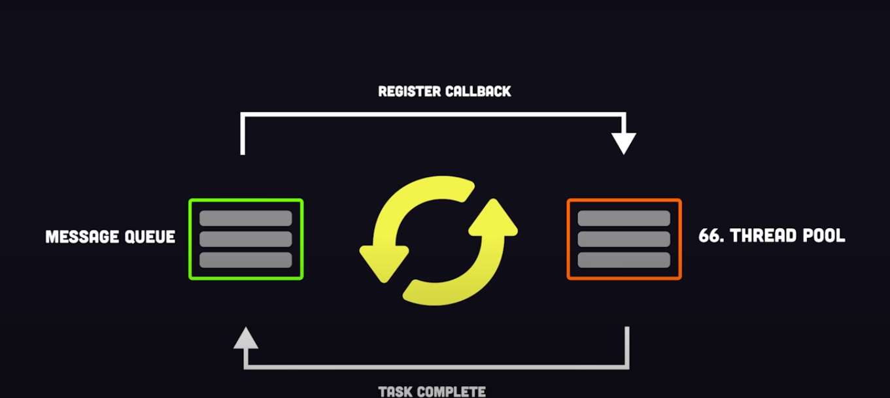

## Modern JS course

What is JS:

A highly level single threaded, interpreted, garbage collected, JIT(just in time) compiled, prototyped based, multi paradigm, dynamic langauage with a non blocking event loop

* Created at <u>1993</u> by **Brendan Eich** with a goal of adding easy to use scripting language with Netscape browser


Famously know for building front end as is only language supported by browers after web assembly

>> Now it even used for server side with Node/Bun runtime, mobile applications with React native, Desktop applications with Electron

JIT


* It is also a excelent language to create I/O applications made possible by non blocking event loop



### To run JavaScript
There are 2 ways of executing it.
1. In browser by linking it to a HTML file
2. Or by using any runtime environments


Variables:
* `var` is original way but not recommended
* `let` for variables that can be reassigned
* `const` for variables that cannot be reassigned

* It support Classes for OOP
* It can run on server with Node.js

Event though it a single threaded it can work asynchoronously with Promise API and async-await syntax


## Javascript 101
[Video link](https://www.youtube.com/watch?v=lkIFF4maKMU&ab_channel=Fireship)

1. Standard of Javascript is called ECMA script
2. You can only run ECMA script and Webassemly on browers
3. Now not only browers can run js but also some run-time environment like node/bun/deno can run in server
4. Javascript is a scripting language.
5. Its a interpreted language, which means interpreted line by like unlike compiler languages which are compiled ahead of time.
6. Under the hood the browser take code and convertes to machine code with JIT(just in time) compilers
7. Dynamically typed, which means no data types need to be told initially.
8. Semicolans are optional, anytime you forget the js with add during compilation; 
9. Lexical environment -> It defines where variables are accessable
10. Global scope -> Things will be available everywhere
11. Local scope -> it will work only within wrapped { } unlike var
12. `var` will be hoisted up with parent function {} blocks only and dont follow other blocks 
13. Functions are nothing but objects hence they can be used as expressions: `const greet = function(){}`
14. Function is used as argument or a return value
15. Closures❓
16. `this` -> refers on how it is called
    * if called from global then references global/window object
    * if called from function then refers the parent function
17. We can bind a variable or function by using bind method
```js
function wtfIsThis(){
  cosole.log(this)
}

const a = 10
wtfIsThis.bind(a)
```

18. Arrow functions don't have their this values and they are always anonymous. They are ideal for function expressions
19. asf
```js
const num = 29
const data = new Object()

sumFunc(num, data)
```
* When premitive datatype `num` is passed, it is passed by value i.e a copy of value is created
* When non premitive data is passed, then it's passed by reference from the heap, that means multiple parts of code will be mutating(changing/updating) the same objects

20. Object literal
```js
// Object literal syntax
const data = {
  // Collection of key-value pairs or properties-values
}
```
21. Using constructor
```js
const data = new Object()
```

22. Classes❓ set/get dunder methods
23. Its garbage collected, that means it will deallocate memory when are no longer needed or referenced in your code
24. Syncronouly, that mean the next line can start until the previous line has completly finished
25. With an event loop we can write asyncronouly in js which runs in different thread pool without effecting the main queue

26. Callback -> it called when it is ready in event loop 
27. But when they're overused and becomes clumsy hence it is called <u>Callback hell</u>
28. To fix callback hell promises were introduced, 
29. A promise is a wrapper to value that is unknown right now but will _resolve_ in the future or if something goes wrong then the promise can _reject_
30. We can use methods like `.then()` & `.catch()` to handle the above conditions  
31. Modules to share code between files and it have private access specifier
32. We can make it a public by exporting it with default
```js
export default myFunc
```
33. Named Imports by destructing
```js
import {} from "file.js"
```
34. On web js is executed in document model called DOM(document object model)
